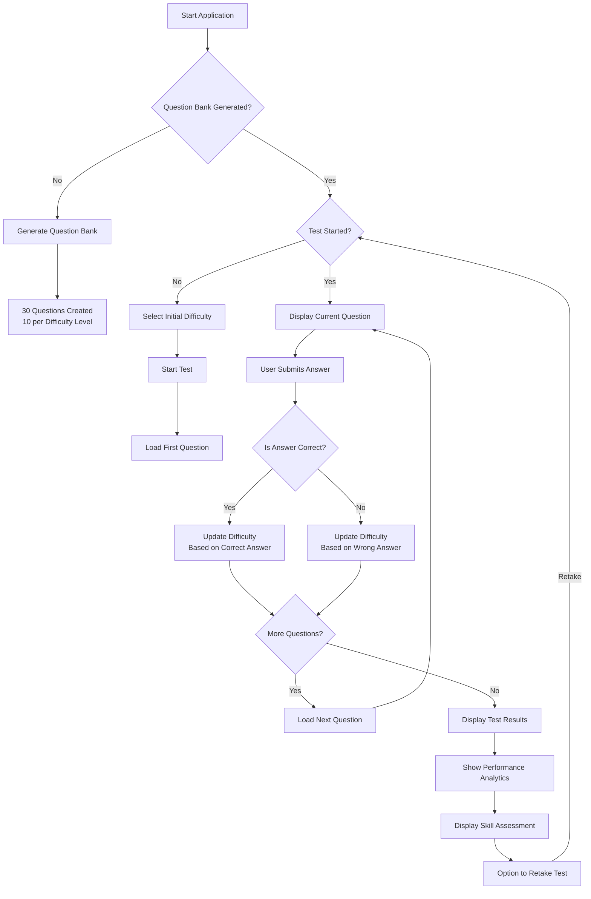
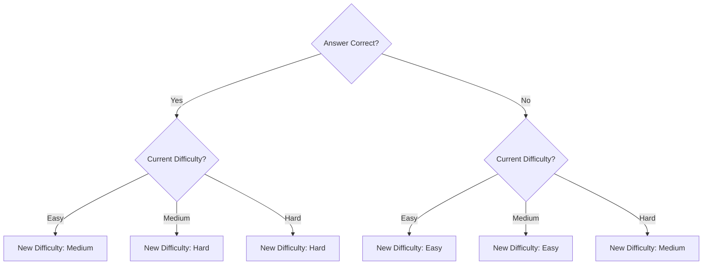

# Adaptive GMAT Quantitative Test

## Overview
This Streamlit application provides an adaptive testing experience for GMAT quantitative practice. The app dynamically adjusts question difficulty based on user performance, simulating the adaptive nature of the actual GMAT exam.

## Try it now!!
[Click here](https://gmattest.streamlit.app/)

## Features
- **Question Generation**: Uses Mistral-7B to generate unique GMAT-style quantitative questions
- **Adaptive Testing**: Adjusts question difficulty based on performance
- **Three Difficulty Levels**: Easy, Medium, and Hard questions
- **Performance Analytics**: Detailed performance statistics a# Adaptive GMAT Quantitative Test

## Overview
This Streamlit application provides an adaptive testing experience for GMAT quantitative practice. The app dynamically adjusts question difficulty based on user performance, simulating the adaptive nature of the actual GMAT exam.

## Features
- **Question Generation**: Uses Mistral-7B to generate unique GMAT-style quantitative questions
- **Adaptive Testing**: Adjusts question difficulty based on performance
- **Three Difficulty Levels**: Easy, Medium, and Hard questions
- **Performance Analytics**: Detailed performance statistics and visualization
- **Intelligent Scoring**: Weighted scoring system that accounts for question difficulty

## Requirements
- Python 3.7+
- Streamlit
- HuggingFace API token (stored in `.env` file)
- Required Python packages:
  - streamlit
  - huggingface_hub
  - pandas
  - matplotlib
  - numpy
  - python-dotenv

## Setup
1. Clone this repository
2. Install required packages: `pip install -r requirements.txt`
3. Create a `.env` file in the project root with your HuggingFace API token:
   ```
   HF_TOKEN=your_huggingface_token_here
   ```
4. Run the application: `streamlit run app.py`

## How It Works

### Question Bank Generation
- Application generates 10 questions for each difficulty level (easy, medium, hard)
- Uses pre-defined prompt templates for each difficulty
- Formats responses as JSON with question text, answer choices, and correct answer

### Adaptive Algorithm
- **If user answers correctly**:
  - Easy → Medium
  - Medium → Hard
  - Hard → Hard (remains unchanged)
- **If user answers incorrectly**:
  - Easy → Easy (remains unchanged)
  - Medium → Easy
  - Hard → Medium

### Scoring System
- Easy questions: 1 point
- Medium questions: 2 points
- Hard questions: 3 points
- Both raw scores and weighted scores (giving more weight to later questions) are calculated

## User Flow
1. Generate question bank
2. Select starting difficulty
3. Answer 10 questions with adaptive difficulty adjustment
4. Receive detailed performance analysis and skill assessment

## Flow Diagram


## Difficulty Adjustment Logic


## Performance Analysis
The application provides:
- Raw score and percentage
- Weighted score that emphasizes later questions
- Difficulty progression chart
- Detailed question-by-question breakdown
- Performance statistics by difficulty level
- Overall skill assessment and recommendations

## Skill Assessment Categories
- **Advanced**: 80%+ overall with 70%+ on hard questions
- **Proficient**: 80%+ overall with 70%+ on medium questions
- **Intermediate**: 80%+ overall but <70% on harder questions
- **Developing**: 60-80% overall
- **Foundational**: <60% overall

## License
MIT License

## Acknowledgments
- This application uses the Mistral-7B model from HuggingFace for question generation
- Built with Streamlit for interactive web interfacend visualization
- **Intelligent Scoring**: Weighted scoring system that accounts for question difficulty

## Requirements
- Python 3.7+
- Streamlit
- HuggingFace API token (stored in `.env` file)
- Required Python packages:
  - streamlit
  - huggingface_hub
  - pandas
  - matplotlib
  - numpy
  - python-dotenv

## Setup
1. Clone this repository
2. Install required packages: `pip install -r requirements.txt`
3. Create a `.env` file in the project root with your HuggingFace API token:
   ```
   HF_TOKEN=your_huggingface_token_here
   ```
4. Run the application: `streamlit run app2.py`

## How It Works

### Question Bank Generation
- Application generates 10 questions for each difficulty level (easy, medium, hard)
- Uses pre-defined prompt templates for each difficulty
- Formats responses as JSON with question text, answer choices, and correct answer

### Adaptive Algorithm
- **If user answers correctly**:
  - Easy → Medium
  - Medium → Hard
  - Hard → Hard (remains unchanged)
- **If user answers incorrectly**:
  - Easy → Easy (remains unchanged)
  - Medium → Easy
  - Hard → Medium

### Scoring System
- Easy questions: 1 point
- Medium questions: 2 points
- Hard questions: 3 points
- Both raw scores and weighted scores (giving more weight to later questions) are calculated

## User Flow
1. Generate question bank
2. Select starting difficulty
3. Answer 10 questions with adaptive difficulty adjustment
4. Receive detailed performance analysis and skill assessment

## Flow Diagram


## Difficulty Adjustment Logic


## Performance Analysis
The application provides:
- Raw score and percentage
- Weighted score that emphasizes later questions
- Difficulty progression chart
- Detailed question-by-question breakdown
- Performance statistics by difficulty level
- Overall skill assessment and recommendations

## Skill Assessment Categories
- **Advanced**: 80%+ overall with 70%+ on hard questions
- **Proficient**: 80%+ overall with 70%+ on medium questions
- **Intermediate**: 80%+ overall but <70% on harder questions
- **Developing**: 60-80% overall
- **Foundational**: <60% overall


## Acknowledgments
- This application uses the Mistral-7B model from HuggingFace for question generation
- Built with Streamlit for interactive web interface
